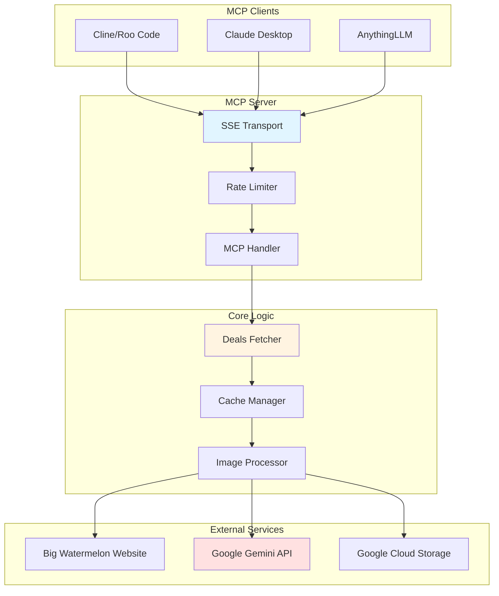

# Big Watermelon Daily Deals MCP Server

An MCP (Model Context Protocol) server that automatically fetches and analyzes daily produce deals from [Big Watermelon](https://www.bigwatermelon.com.au/), a fruit and vegetable wholesale store in Melbourne, Australia. The server uses Google Gemini AI to extract deal information from images and makes it available to AI agents via the MCP protocol.

## Features

- **Automated Daily Fetching**: Retrieves deals once per day after 7 AM Australia/Melbourne time
- **AI-Powered Extraction**: Uses Google Gemini to analyze deal images and extract structured data
- **Intelligent Caching**: 24-hour cache to minimize API calls and improve performance
- **Production-Ready**: Includes rate limiting, graceful shutdown, comprehensive logging, and error handling
- **Highly Configurable**: All settings configurable via environment variables
- **Performance Optimized**: Worker pool pattern, streaming uploads, and concurrent processing
- **SSE Transport**: Server-Sent Events for real-time MCP communication

## Architecture



## Requirements

- **Go**: 1.24.3 or later
- **Google Gemini API Key**: Required for image analysis
- **Optional**: Docker for containerized deployment

## Installation

### Local Setup

1. **Clone the repository**:
   ```bash
   git clone https://github.com/hebra/ahemseepee/daily-deals-mcp-server.git
   cd daily-deals-mcp-server
   ```

2. **Set up environment variables**:
   ```bash
   export GEMINI_API_KEY=your-gemini-api-key-here
   ```

3. **Install dependencies**:
   ```bash
   make deps
   ```

4. **Build and run**:
   ```bash
   make build
   make run
   ```

The server will start on `http://localhost:8080` with the following endpoints:
- `GET /sse` - SSE connection endpoint for MCP clients
- `POST /message` - MCP message endpoint
- `GET /health` - Health check endpoint
- `GET /ready` - Readiness check endpoint

### Docker Setup

```bash
# Build Docker image
make docker-build

# Run Docker container
make docker-run
```

## Configuration

All configuration is done via environment variables with sensible defaults:

### Required Configuration

| Variable | Description | Default |
|----------|-------------|---------|
| `GEMINI_API_KEY` | Google Gemini API key for image analysis | **(Required)** |

### Server Configuration

| Variable | Description | Default |
|----------|-------------|---------|
| `PORT` | HTTP server port | `8080` |
| `RATE_LIMIT_REQUESTS` | Maximum requests per window | `100` |
| `RATE_LIMIT_WINDOW` | Rate limit time window | `1m` |

### Fetching Configuration

| Variable | Description | Default |
|----------|-------------|---------|
| `FETCH_HOUR` | Hour to fetch deals (0-23, Melbourne time) | `7` |
| `CACHE_FILE` | Path to cache file | `bigwatermelon-dailydeals.cached.json` |
| `SPECIALS_URL` | URL to scrape for deals | `https://www.bigwatermelon.com.au/category/specials/` |
| `TIMEZONE` | Timezone for scheduling | `Australia/Melbourne` |

### Business Information

| Variable | Description | Default |
|----------|-------------|---------|
| `BUSINESS_NAME` | Business name in responses | `Big Watermelon Bushy Park` |
| `LOCATION_LATITUDE` | Business latitude | `-37.8748714` |
| `LOCATION_LONGITUDE` | Business longitude | `145.2053244` |
| `LOCATION_ADDRESS` | Street address | `1161 High St Rd` |
| `LOCATION_CITY` | City | `Wantirna South` |
| `LOCATION_STATE` | State | `VIC` |
| `LOCATION_ZIP` | Postal code | `3152` |
| `LOCATION_COUNTRY` | Country | `Australia` |

### Performance Configuration

| Variable | Description | Default |
|----------|-------------|---------|
| `HTTP_TIMEOUT` | HTTP client timeout | `30s` |
| `GEMINI_TIMEOUT` | Gemini API timeout | `60s` |
| `OVERALL_TIMEOUT` | Overall operation timeout | `300s` |
| `MAX_CONCURRENT_GOROUTINES` | Worker pool size | `5` |
| `MAX_RETRIES` | Maximum retry attempts | `3` |
| `RETRY_BASE_DELAY` | Base delay between retries | `1s` |

### Google Cloud Configuration

| Variable | Description | Default |
|----------|-------------|---------|
| `GCP_FILE_PREFIX` | Prefix for uploaded files | `au-bigwatermelon-image-` |
| `GEMINI_MODEL` | Gemini model to use | `gemini-1.5-flash` |

## Development

### Available Make Commands

```bash
make help          # Show all available commands
make build         # Build the application
make run           # Build and run the application
make dev           # Start development server with hot reload (requires air)
make test          # Run tests
make coverage      # Generate test coverage report
make fmt           # Format code
make lint          # Run linter
make vet           # Run go vet
make tidy          # Tidy and verify dependencies
make clean         # Clean build artifacts
```

### Running Tests

```bash
# Run all tests
make test

# Run specific test
go test -v ./internal -run TestFunctionName

# Generate coverage report
make coverage
```

### Code Quality

```bash
# Format code
make fmt

# Run linter
make lint

# Run static analysis
make vet
```

## Configuring MCP Clients

This server uses **SSE (Server-Sent Events)** transport. You can either:
1. Run the server locally (see [Installation](#installation))
2. Use the hosted instance at `https://daily-deals-mcp-server-7ow81.kinsta.app/`

### Cline / Roo Code

Add to your MCP settings file (typically `~/.roo/mcp_settings.json` or VSCode settings):

**Hosted Server:**
```json
{
  "mcpServers": {
    "bigwatermelon-deals": {
      "type": "sse",
      "url": "https://daily-deals-mcp-server-7ow81.kinsta.app/sse"
    }
  }
}
```

**Local Server:**
```json
{
  "mcpServers": {
    "bigwatermelon-deals": {
      "type": "sse",
      "url": "http://localhost:8080/sse"
    }
  }
}
```

### Claude Desktop

Add to `~/Library/Application Support/Claude/claude_desktop_config.json` (macOS) or `%APPDATA%\Claude\claude_desktop_config.json` (Windows):

**Hosted Server:**
```json
{
  "mcpServers": {
    "bigwatermelon-deals": {
      "type": "sse",
      "url": "https://daily-deals-mcp-server-7ow81.kinsta.app/sse"
    }
  }
}
```

**Local Server:**
```json
{
  "mcpServers": {
    "bigwatermelon-deals": {
      "type": "sse",
      "url": "http://localhost:8080/sse"
    }
  }
}
```

### AnythingLLM

1. Navigate to Settings → MCP Servers
2. Add a new server with:
   - **Name**: `bigwatermelon-deals`
   - **Transport**: `SSE`
   - **URL**: `https://daily-deals-mcp-server-7ow81.kinsta.app/sse` (hosted) or `http://localhost:8080/sse` (local)

### Generic MCP Client

For any MCP-compatible client that supports SSE transport:

**Hosted Server:**
```json
{
  "transport": "sse",
  "url": "https://daily-deals-mcp-server-7ow81.kinsta.app/sse"
}
```

**Local Server:**
```json
{
  "transport": "sse",
  "url": "http://localhost:8080/sse"
}
```

## Available Tools

### `get-big-watermelon-deals`

Retrieves today's fruit and vegetable deals from Big Watermelon.

**Parameters:** None

**Returns:**
```json
{
  "lastUpdated": "2025-01-23",
  "business": "Big Watermelon Bushy Park",
  "location": {
    "latitude": -37.8748714,
    "longitude": 145.2053244,
    "address": "1161 High St Rd",
    "city": "Wantirna South",
    "state": "VIC",
    "zip": "3152",
    "country": "Australia"
  },
  "offers": [
    {
      "productName": "Bananas",
      "price": 2.99,
      "currency": "AUD",
      "size": "kg"
    }
  ]
}
```

## Project Structure

```
.
├── main.go                          # Application entry point, MCP server setup
├── internal/
│   ├── config.go                    # Configuration management
│   ├── config_test.go               # Configuration tests
│   ├── models.go                    # Data models
│   ├── big-watermelon-deals-fetcher.go    # Core fetching logic
│   └── big-watermelon-deals-fetcher_test.go  # Fetcher tests
├── .roo/                            # Roo Code AI assistant rules
├── Makefile                         # Build and development commands
├── go.mod                           # Go module definition
├── go.sum                           # Go module checksums
├── LICENSE                          # GPL-3.0 license
└── README.md                        # This file
```

## How It Works

1. **Scheduling**: Server waits until 7 AM Australia/Melbourne time before fetching deals
2. **Cache Check**: Checks if deals for today are already cached
3. **Web Scraping**: If not cached, scrapes the Big Watermelon specials page for image URLs
4. **Image Processing**: 
   - Downloads images matching the pattern `SPECIALS*.jpg`
   - Uploads to Google Cloud Storage (temporary)
   - Sends to Gemini AI for analysis
5. **Data Extraction**: Gemini extracts product names, prices, and sizes from images
6. **Cleanup**: Automatically deletes uploaded images from Google Cloud
7. **Caching**: Stores results in local cache file for 24 hours
8. **Response**: Returns structured JSON data to MCP clients

## Performance & Reliability Features

- **Concurrent Processing**: Worker pool pattern limits concurrent operations (default: 5)
- **Streaming Uploads**: Reduces memory footprint by streaming image data
- **Timeout Management**: Configurable timeouts prevent indefinite hangs
- **Rate Limiting**: Protects server from abuse (default: 100 requests/minute)
- **Graceful Shutdown**: Properly closes connections on termination
- **Structured Logging**: Comprehensive logging with request IDs for tracing
- **Error Handling**: Robust error handling with retries and exponential backoff
- **Race Condition Protection**: Mutex-protected concurrent operations

## Troubleshooting

### Server won't start

**Problem**: `GEMINI_API_KEY` not set
```
Configuration validation failed: validation error for GEMINI_API_KEY: API key is required
```

**Solution**: Set the environment variable:
```bash
export GEMINI_API_KEY=your-api-key-here
```

### No deals returned

**Problem**: Server hasn't reached 7 AM Melbourne time yet

**Solution**: The server only fetches deals after 7 AM Australia/Melbourne time. Check logs for:
```
Current time is before fetch hour, skipping fetch
```

You can override this by setting `FETCH_HOUR=0` to fetch immediately.

### Rate limit errors

**Problem**: Too many requests
```
Rate limit exceeded: Too many requests. Please try again later.
```

**Solution**: Wait for the rate limit window to reset (default: 1 minute) or increase limits:
```bash
export RATE_LIMIT_REQUESTS=200
export RATE_LIMIT_WINDOW=1m
```

### Timeout errors

**Problem**: Operations timing out

**Solution**: Increase timeout values:
```bash
export HTTP_TIMEOUT=60s
export GEMINI_TIMEOUT=120s
export OVERALL_TIMEOUT=600s
```

### Memory issues

**Problem**: High memory usage

**Solution**: Reduce concurrent operations:
```bash
export MAX_CONCURRENT_GOROUTINES=3
```

## License

This project is licensed under the GNU General Public License v3.0 - see the [LICENSE](LICENSE) file for details.

## Contributing

Contributions are welcome! Please feel free to submit a Pull Request.

## Acknowledgments

- [Big Watermelon](https://www.bigwatermelon.com.au/) for providing daily deals
- [Google Gemini](https://ai.google.dev/) for AI-powered image analysis
- [MCP Protocol](https://github.com/ThinkInAIXYZ/go-mcp) for the Model Context Protocol implementation
